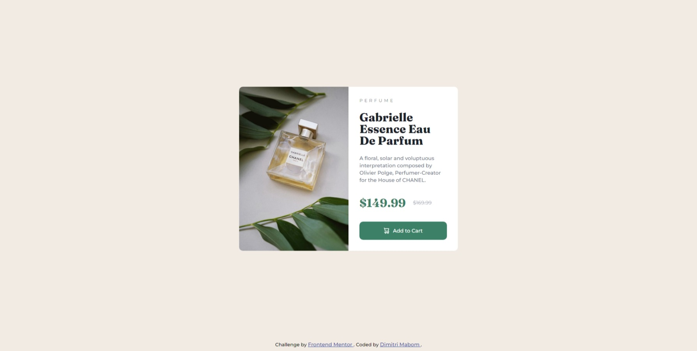

# Frontend Mentor - Product preview card component solution

This is a solution to the [Product preview card component challenge on Frontend Mentor](https://www.frontendmentor.io/challenges/product-preview-card-component-GO7UmttRfa). Frontend Mentor challenges help you improve your coding skills by building realistic projects. 
## Table of contents

- [Overview](#overview)
  - [Screenshot](#screenshot)
  - [Links](#links)
- [My process](#my-process)
  - [Built with](#built-with)
  - [What I learned](#what-i-learned)
  - [Useful resources](#useful-resources)
- [Author](#author)

## Overview

### Screenshot



### Links

- Solution URL: [https://github.com/dimitrimabom/product-preview-card-component](https://github.com/dimitrimabom/product-preview-card-component)
- Live Site URL: [https://product-preview-card-component-80cn.onrender.com](https://product-preview-card-component-80cn.onrender.com)

## My process

### Built with

- Semantic HTML5 markup
- CSS custom properties
- Flexbox
- SCSS

### What I learned

This component has allowed me to discover how to use content in CSS. I used it to change the URL of the images in telephone view.

```css
.image-product {
    content: url("./images/image-product-mobile.jpg");
  }
```

### Useful resources

- [SCSS Docs](https://sass-lang.com/guide/) - Install Sass and learn out to use.

## Author

- Website - [Dimitri Mabom](https://github.com/dimitrimabom)
- Frontend Mentor - [@dimitrimabom](https://www.frontendmentor.io/profile/dimitrimabom)
- Linkedin - [Dimitri Mabom](https://www.linkedin.com/in/dimitri-mabom/)
